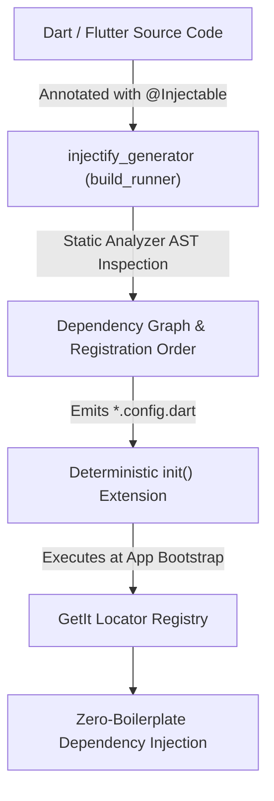

Welcome to the **Injectify** documentation. Injectify is a code-generation dependency injection toolkit for Dart and Flutter built on top of [GetIt](https://pub.dev/packages/get_it).

It automates service locator registration, manages asynchronous dependency resolution, isolates modular domains via **Folder-Scoped Micro-Packages**, and supports seamless multi-package monorepo architectures.

---

## Documentation Structure

Our documentation is structured into focused areas:



Step-by-step guides to install Injectify, set up `build_runner`, and configure your first dependency graph.

[Go to Getting Started](/docs/getting-started/)



Deep dive into lifetimes, folder-scoped micro-packages, asynchronous resolution, and environment gating.

[Explore Concepts](/docs/concepts/)





Practical, task-oriented guides for handling custom disposal, named bindings, abstract interfaces, and third-party modules.

[View Tasks](/docs/tasks/)



Complete, end-to-end learning walkthroughs for building modular Flutter apps and multi-package monorepos.

[Browse Tutorials](/docs/tutorials/)





Equip AI coding assistants (Claude Code, Cursor, Antigravity, GitHub Copilot) with official Injectify skills.

[Explore Agent Skills](/docs/skills/)



Comprehensive specifications for all annotations, CLI builder options, error diagnostics, and terms.

[Browse Reference](/docs/reference/)



---

## Architecture at a Glance

---

## Core Advantages

- **Zero Boilerplate Wiring**: Constructor parameters are automatically resolved from the locator (`gh<T>()`), eliminating manual graph assembly.
- **Folder-Scoped Micro-Packages**: Isolate feature folders with `@InjectableMicroPackage` so dependencies belong strictly to their domain.
- **Cross-Pubspec Composition**: Seamlessly compose modules from other packages in a monorepo via `externalMicroPackages`.
- **Compile-Time Safety**: Code generation happens before compile time, eliminating reflective overhead and runtime lookup failures.
- **Class-Form Annotations**: Pure Dart class annotations (`@Injectable(scope: Scope.lazySingleton)`).
