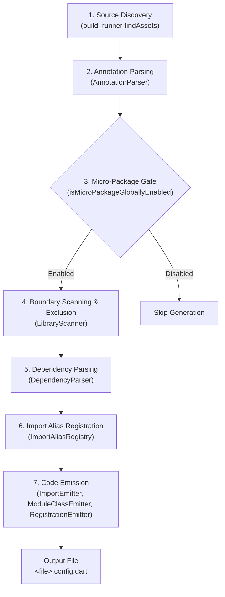

Injectify is composed of two primary layers:

1. **Runtime Framework (`package:injectify`)**: Lightweight annotations, interfaces, and the `GetItHelper` adapter.
2. **Build-Time Generator (`package:injectify_generator`)**: An analyzer-driven `build_runner` builder that parses Dart code and generates type-safe configuration files.

---

## 1. High-Level Generation Pipeline

The generation process executes as a pipeline with six distinct stages:

---

## 2. Detailed Pipeline Stages

### Stage 1: Annotation Parsing (`AnnotationParser`)

The generator inspects the entry-point file for `@InjectableInit` or `@InjectableMicroPackage`. It extracts:

- Initializer method name (`initializerName`, default `'init'`).
- Micro-package flags (`useMicroPackage`, `modules`, `externalMicroPackages`).
- Custom naming (`moduleName`, `moduleClassName`).
- Generation preferences (`preferRelativeImports`, `asExtension`).

{}
`AnnotationParser` employs dual-mode resolution: a primary `TypeChecker` / `ConstantReader` mechanism, paired with an AST syntactic fallback for scenarios where constant analysis is incomplete.
{}

### Stage 2: Micro-Package Gating (`isMicroPackageGloballyEnabled`)

Before generating code for a micro-package, the builder scans `lib/**.dart` to verify whether micro-package mode is globally active in the package. If a root initializer exists with `useMicroPackage: false`, sub-folder micro-package generation is skipped to avoid orphaned or conflicting output.

### Stage 3: Boundary Scanning & Exclusion (`LibraryScanner`)

`LibraryScanner` computes the scan boundary:

- For **root compositors**, the glob is `lib/**.dart`.
- For **folder micro-packages**, the glob is restricted to the folder containing the annotated file (e.g. `lib/features/cart/**.dart`).
- **Boundary Exclusion**: Any nested subdirectories containing their own `@InjectableMicroPackage` are discovered and dynamically excluded from the parent module's scan. This guarantees that sub-feature dependencies are never duplicate-registered.

### Stage 4: Dependency Parsing (`DependencyParser`)

For every class within the computed scan boundary, `DependencyParser` extracts:

- Target lifecycle (`Scope.factory`, `Scope.singleton`, `Scope.lazySingleton`).
- Bound interfaces (`@Injectable(as: ServiceInterface)`).
- Constructor parameters and their injection qualifiers (`@Inject('tag')`, `@FactoryParam`).
- Environment restrictions (`@Environment('dev')`, `env: [...]`).
- Async initialization status (`@PreResolve` or `Future` return types).
- Explicit sort order (`@Order(int)`).

### Stage 5: Import Aliasing (`ImportAliasRegistry`)

To prevent identifier collisions between classes with identical names across different libraries or packages, `ImportAliasRegistry` assigns unique prefixes (`_i1`, `_i2`, ... `_iN`) for each imported package or library.

### Stage 6: Code Emission

The emitters write the finalized `.config.dart` file:

- `ImportEmitter`: Generates prefixed imports and header doc comments.
- `ModuleClassEmitter`: Generates the `MicroPackageModule` class or `GetIt` extension method.
- `RegistrationEmitter`: Emits calls to `gh.factory()`, `gh.singleton()`, `gh.lazySingleton()`, `gh.singletonAsync()`, `gh.factoryWithParam()`, and external micro-package invocations.

---

## 3. Emitted Output Types

Depending on the annotation used on the target file, Injectify produces one of two output structures:

- **`@InjectableInit()`** — produces an `extension GetItInjectableX on GetIt` with an `init()` method. Used for top-level application bootstrap.
- **`@InjectableMicroPackage()`** — produces a subclass of `MicroPackageModule` (e.g. `AuthInjectableModule`). Used for reusable feature modules.
