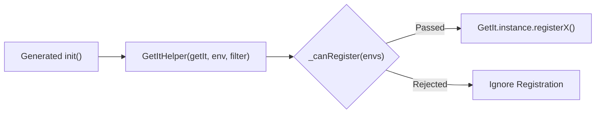

Dependency Injection (DI) is a software design pattern where an object's dependencies are provided to it from the outside, rather than constructed internally.

---

## 1. Declarative DI vs Manual Service Locator

Traditional use of service locators (like `GetIt`) often leads to verbose manual wiring:

```dart
// Manual approach - boilerplate-heavy and prone to ordering errors
getIt.registerLazySingleton<HttpClient>(() => HttpClient());
getIt.registerLazySingleton<AuthService>(() => AuthService(getIt<HttpClient>()));
getIt.registerFactory<UserRepository>(() => UserRepository(getIt<AuthService>(), getIt<HttpClient>()));
```

Injectify replaces this with declarative annotations:

```dart
// Declarative approach - clean and decoupled
@Injectable(scope: Scope.lazySingleton)
class AuthService {
  final HttpClient client;
  AuthService(this.client);
}

@Injectable()
class UserRepository {
  final AuthService authService;
  final HttpClient client;
  UserRepository(this.authService, this.client);
}
```

---

## 2. Compile-Time Resolution

Injectify generates pure Dart registration code during the build step. This design offers several advantages:

1. **Zero Reflection**: Works seamlessly with Ahead-Of-Time (AOT) compilation on Flutter Web, iOS, Android, and Dart Native without `dart:mirrors`.
2. **Deterministic Startup**: Dependency instantiation logic is explicitly written in `.config.dart`, making debugging and stepping through breakpoints straightforward.
3. **Type Safety**: Type mismatches are caught during `dart run build_runner build` and standard `dart analyze` compilation.

---

## 3. The `GetItHelper` Pattern

Injectify routes all registrations through `GetItHelper` (`gh`):



`GetItHelper` abstracts:

- Environment filtering.
- Callable lookup syntax: `gh<T>()` or `gh<T>(instanceName: '...')`.
- Micro-package initialization: `gh.initMicroPackage(Module())`.
