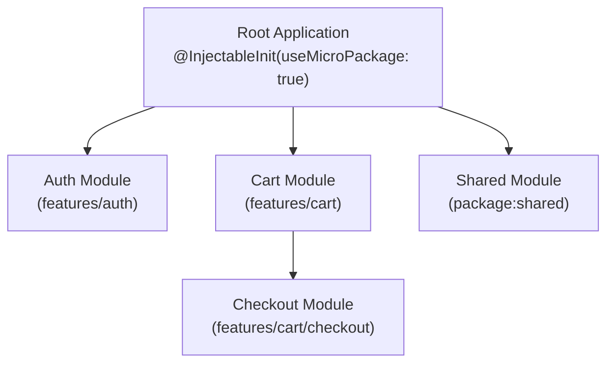

As codebases grow, monolithic dependency registrations become unwieldy. Injectify provides **Folder-Scoped Micro-Packages** to partition registrations into modular, isolated units.

---

## 1. Concept of Micro-Packages

A micro-package is an isolated module of dependencies defined within a folder or package. It generates a class extending `MicroPackageModule`:

```dart
abstract class MicroPackageModule {
  const MicroPackageModule();
  FutureOr<void> init(GetItHelper gh);
}
```



---

## 2. Modes of Micro-Package Composition

Injectify supports multiple composition models:

- **Monolithic Root** — `@InjectableInit()` — Scans `lib/**` as a single monolithic container.
- **Root Compositor** — `@InjectableInit(useMicroPackage: true)` — Scans `lib/**`, discovers all folder micro-packages, excludes their folders from local scan, and composes them flatly at root.
- **Folder Micro-Package** — `@InjectableMicroPackage(moduleName: 'X')` — Scans only its own directory. Sibling and parent folders are invisible.
- **Module Compositor** — `@InjectableMicroPackage(useMicroPackage: true)` — Scans its own folder, discovers nested sub-micro-packages, and composes nested modules inside its own `init()`.
- **External Composition** — `externalMicroPackages: [ExternalMicroPackage(ModuleType)]` — Explicitly composes modules from other `pubspec.yaml` packages in declaration order.

---

## 3. Boundary Scanning & Exclusion

When `@InjectableInit(useMicroPackage: true)` or a parent micro-package scans a directory:

1. It searches for all files annotated with `@InjectableMicroPackage`.
2. It records the module and its directory path (e.g. `lib/features/auth`).
3. It **excludes** `lib/features/auth/**` from the parent's dependency scan.
4. It emits an explicit `gh.initMicroPackage(AuthInjectableModule())` call in the generated `init()` method.

This boundary isolation ensures:

- Feature internal classes cannot accidentally pollute or conflict with other features.
- No class is registered twice in `GetIt`.

---

## 4. The Single-Composition Rule

{}
**Compose each micro-package exactly once**:
Either a parent folder module composes its nested sub-module (`useMicroPackage: true`), **or** the root app composes it. Composing the same module in multiple places will cause `GetIt` to throw a double-registration error at runtime.
{}
